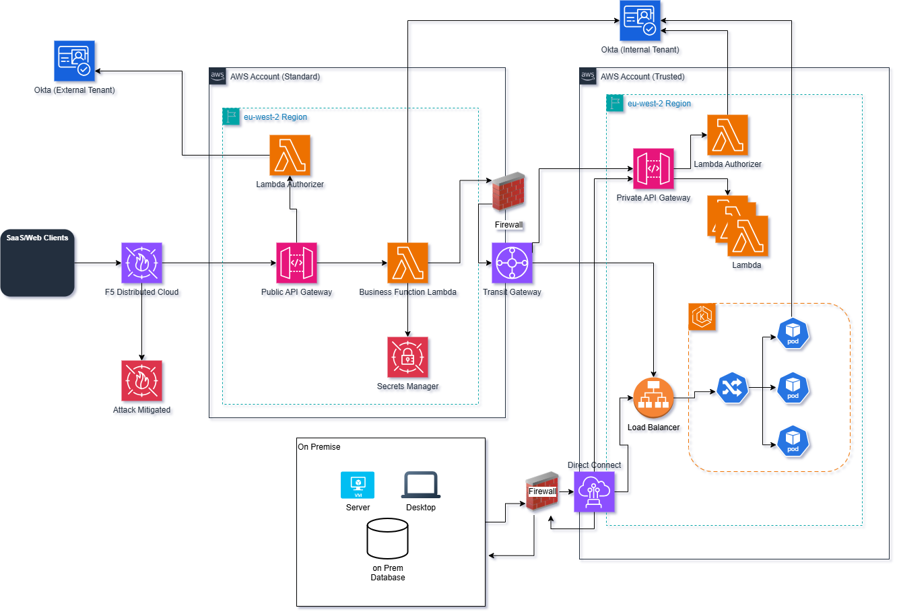
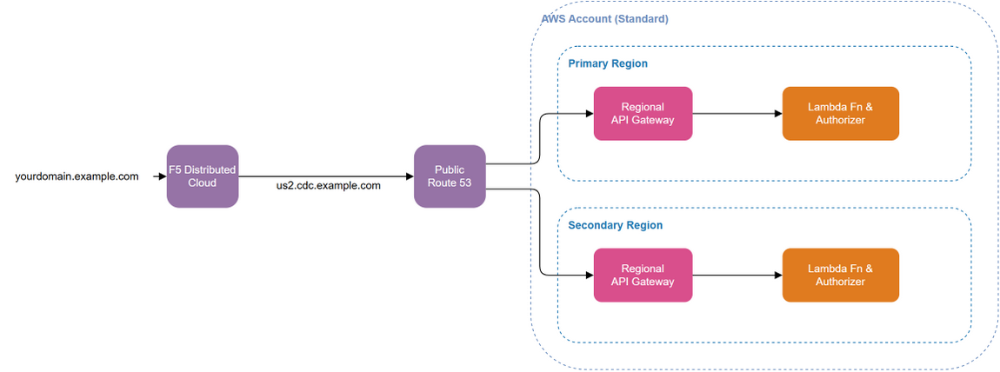
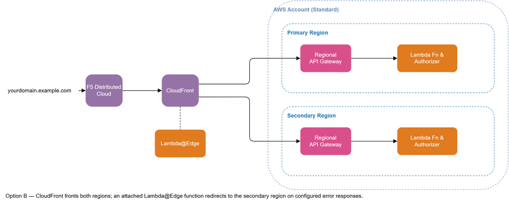
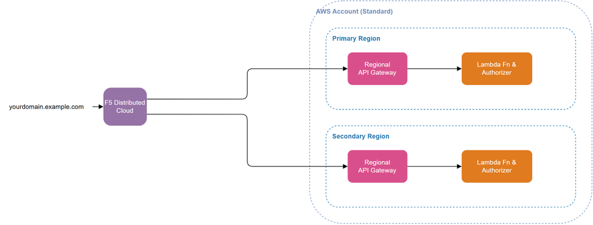

# AWS API Architecture

**Cloud Application Pattern · Internal & External API Architecture**

---

## Overview

This pattern documents the end-to-end architecture for exposing business capabilities as APIs to
both external (B2B/SaaS) clients and internal/on-premises consumers. External traffic enters
through a Standard AWS account secured by OKTA and F5 Distributed Cloud, then crosses into a
Trusted AWS account where the API is implemented as either a **containerized service on Amazon
EKS** or a **fully serverless API built on Amazon API Gateway and AWS Lambda** — both are equally
supported implementations of the same pattern, secured the same way, and can coexist.

The on-premises data center is treated as an equally trusted network, not just a downstream
dependency: it connects directly to the Trusted Account over **Direct Connect**, bypassing F5
Distributed Cloud, OKTA (External Tenant), and the Standard Account entirely. This connectivity is
**bidirectional** — on-premises servers, desktops, and services can call either backend
implementation directly, and the EKS Pods or Lambda functions in the Trusted Account can equally
call back into on-premises systems, services, and databases.

---

## Architecture — Main Flow

*Unified internal/external API architecture spanning a Standard and a Trusted AWS account, plus a
directly-connected on-premises network. Okta's external and internal tenants are external SaaS
identity providers and sit outside the AWS account boundary. The Trusted Account supports two
interchangeable backend implementations — EKS or API Gateway + Lambda — reachable both from the
Standard Account (external clients) and directly from on-premises over Direct Connect, which also
lets the Trusted Account's APIs reach back into on-premises systems, services, and databases.*

> **Source file:** `AWS API Architecture.png` (draw.io export) — editable `.drawio` source not
> currently available in this repository

> **Note:** this export has no numbered step markers on the image itself. The step numbers below
> are supplied for readability and follow the request in reading order.

---

## Pattern Walkthrough

**1 — HTTPS Request (DNS)**

The external client initiates an HTTPS request, routed via DNS to the **F5 Distributed Cloud** Web
Application Firewall service (WAF SaaS), which protects against OWASP Automated Threats to Web
Applications. TLS domain certificates are hosted and maintained in F5 Distributed Cloud.

**2 — F5 Distributed Cloud inspection**

If F5 Distributed Cloud detects an attack or threat, the request is **rejected** and not
forwarded. If it passes, the request is proxied to the **Public API Gateway** in the AWS Account
(Standard). AWS WAF ensures API Gateway can only be reached by the organization's and F5
Distributed Cloud IP addresses.

**3 — Invoke Lambda Authorizer**

The Public API Gateway invokes the **Lambda Authorizer**, passing the client's OKTA credentials,
which are validated against **Okta (External Tenant)**. API Gateway evaluates the resulting
identity-management policy against the requested resource and allows or denies the request.

**4 — Forward to Business Function Lambda**

API Gateway forwards the request to the **Business Function Lambda**, which validates the request
payload and executes the business logic if it's valid. The Lambda reads its configuration and
credentials from **Secrets Manager**.

**5 — Cross-account routing**

The request leaves the Standard Account through the **Firewall** and crosses into the Trusted
Account over the **Transit Gateway** — private AWS backbone routing, with no transit over the
public internet. If the call requires an internal-OKTA JWT, the Business Function Lambda checks
Secrets Manager for a cached, non-expired token first, and only calls **Okta (Internal Tenant)**
directly to mint a new one when none is cached. The token is stored back in Secrets Manager for
reuse and attached to the request going on to the Trusted Account.

**6 — Trusted Account: choice of backend implementation**

From the Transit Gateway, the request reaches one of two equally-supported backend
implementations, described below.

### Option A — Amazon EKS (containerized)

The request arrives at an internal **Application Load Balancer**, which forwards it to a
**Kubernetes Ingress** controller running in the **EKS** cluster. The Ingress routes the request
to one of the backend **Pods**. Before processing, the Pod independently re-validates the internal
OKTA JWT against **Okta (Internal Tenant)**.

### Option B — API Gateway + Lambda (cloud-native)

The request arrives at a **Private API Gateway**, which invokes a **Lambda Authorizer**. The
authorizer validates the internal OKTA JWT directly against **Okta (Internal Tenant)** before
API Gateway forwards the request to the **business function Lambda(s)** that implement the API.

Both options terminate in the same place from the caller's perspective: the response is returned
back through the same path it arrived on — implementation → Transit Gateway → Firewall → Business
Function Lambda → API Gateway → F5 Distributed Cloud → client.

**7 — On-premises access (direct, bidirectional)**

On-premises **Servers**, **Desktops**, and services connect to the AWS Trusted Account over a
dedicated **Direct Connect** link, through a paired **Firewall** on each side. Because the
on-premises network is treated as a trusted peer of the AWS Trusted Account, this path reaches
either backend implementation **directly** — without transiting F5 Distributed Cloud, Okta
(External Tenant), or the Standard Account:

- **On-premises → AWS:** on-prem systems can call the EKS-hosted API (Load Balancer → Ingress →
  Pods) or the cloud-native API (Private API Gateway → Lambda Authorizer → Lambda) directly.
- **AWS → on-premises:** EKS Pods and Lambda functions in the Trusted Account can equally reach
  on-premises systems, services, and the **on-prem Database** over the same Direct Connect link.

> ⚠️ **Security note**
>
> When routing to another account — or to on-premises systems — to access a service, security
> best practices and guidelines must be adhered to. It is recommended to re-verify the validity of
> the OKTA JWT at each hop to ensure it has not been tampered with.

---

## Choosing Between EKS and Cloud-Native

Both backend options are secured and reached identically — from external clients, from each
other's account, and from on-premises — so the choice is primarily an operational one:

| | Amazon EKS (containers) | API Gateway + Lambda (cloud-native) |
|---|---|---|
| Compute model | Long-running Pods behind a Kubernetes Ingress | On-demand functions behind a Private API Gateway |
| Good fit for | Existing containerized workloads, complex runtime/dependency needs | New, lightweight internal APIs, event-driven or variable traffic |
| Scaling | Cluster/HPA-managed pod autoscaling | Automatic, per-request concurrency scaling |
| Operational overhead | Higher — cluster, node groups, and Ingress to manage | Lower — no servers or cluster to manage |
| Identity check | Pod re-validates the internal OKTA JWT | Lambda Authorizer validates the internal OKTA JWT before invocation |

---

## Multi-Region (Active / Passive)

Three deployment options are available for spreading the pattern across regions.

---

### Option A — Active/Passive using Public Route 53 *(Recommended, 1–5 minute failover)*

> **Source file:** `.claude/patterns/diagrams/external-failover-route53.drawio` (editable draw.io
> source) — open in [diagrams.net](https://app.diagrams.net) to edit and re-export the PNG above

A Public Route 53 health-check monitor manages failover from the primary to the secondary region.
F5 Distributed Cloud has a TTL of 5 minutes and Route 53 has a TTL of 1 minute, allowing timely
— but not immediate — failover to the secondary region.

---

### Option B — Active/Passive using CloudFront with Lambda@Edge *(Immediate failover)*

> **Source file:** `.claude/patterns/diagrams/external-failover-cloudfront.drawio` (editable
> draw.io source) — open in [diagrams.net](https://app.diagrams.net) to edit and re-export the PNG
> above

CloudFront and Lambda@Edge perform an immediate failover from the primary to the secondary region
when the API in the primary region returns specified error codes. The Lambda@Edge function is a
custom function you write and can easily modify to configure failover behaviour.

---

### Option C — Active/Active using F5 to load-balance between regions *(1–5 minute failover)*

> **Source file:** `.claude/patterns/diagrams/external-failover-f5.drawio` (editable draw.io
> source) — open in [diagrams.net](https://app.diagrams.net) to edit and re-export the PNG above

F5 Distributed Cloud load-balances traffic between multiple regions and can route all traffic to a
single region if failures are detected in one region. Configuration is managed within F5
Distributed Cloud.

---

## Additional Information

1. If the application is externally facing, acquiring TLS certificates is required as all
   requests must be TLS-encrypted.
2. F5 Distributed Cloud (used for WAF edge protection in steps 1–2, and for multi-region
   load-balancing in Option C) is an **optional, team-driven choice** — see
   `.claude/skills/approved-catalog/SKILL.md` for the decision criteria. Teams without F5
   Distributed Cloud provisioned for their target region, or working on a POC, should substitute
   AWS-native WAF for edge protection and use Multi-Region Option A (Route 53) or Option B
   (CloudFront + Lambda@Edge) instead of Option C.

### Related pages

---

