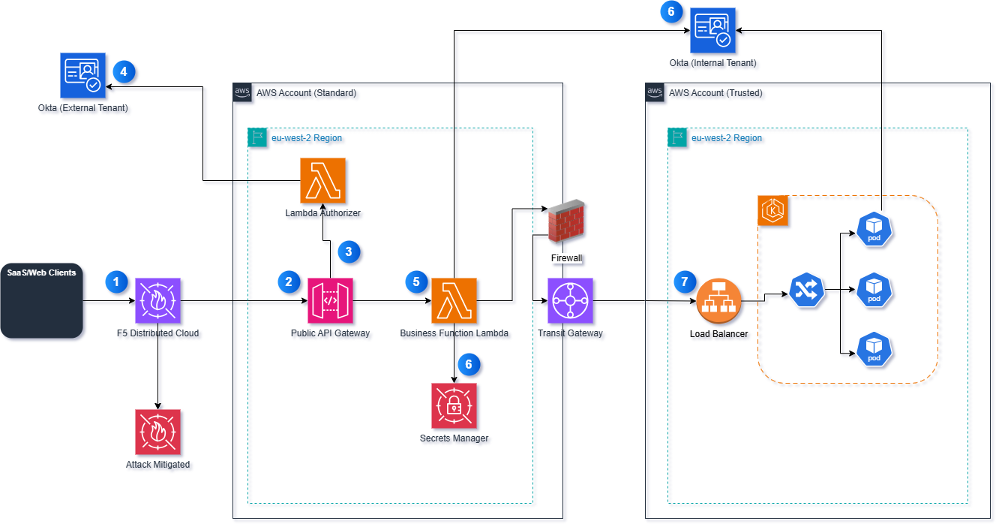

# B2B/SAAS (OKTA Secured)

**Cloud Application Pattern · B2B/SAAS (OKTA Secured)**

Authenticated third-party (B2B / SaaS) access to business capabilities, secured by
OKTA — the preferred external-integration variant.

---

## Overview

The External Integration B2B pattern provides authenticated website visitors — such as customers
and agents — access to the organization's business capabilities. This variant is secured with **OKTA** and
requires the provisioning and use of a client ID for the third party that will access the
application. The OKTA-secured pattern is **preferred** for external integration with third parties.

Prior to the OKTA steps below, the SaaS client must authenticate to acquire the OKTA JWT to
be permitted access. Using the **OKTA OpenID Connect OAuth 2.0 Client Credentials Flow** approach.

---

## Architecture — Main Flow

*OKTA-secured B2B/SaaS integration in a standard AWS account. Okta is an external SaaS identity
provider and sits outside the AWS account boundary. Numbered markers correspond to the walkthrough
below.*

> **Source file:** `external-b2b-saas--eks.drawio` — not currently available in this repository

---

## Pattern Walkthrough

**1 — HTTPS Request (DNS)**

The client initiates an HTTPS request, routed via DNS to the **F5 Distributed Cloud** Web
Application Firewall service (WAF SaaS). F5 Distributed Cloud protects against sophisticated
online attacks, including the OWASP Automated Threats to Web Applications. TLS domain
certificates are hosted and maintained in F5 Distributed Cloud.

**2 — F5 Distributed Cloud inspection**

If F5 Distributed Cloud detects an attack or threat, the request is **rejected** and not
forwarded. If it passes, the request is proxied to the **Public API Gateway**. AWS WAF ensures
API Gateway can only be reached by the organization's and F5 Distributed Cloud IP addresses.

**3 — Invoke Lambda Authorizer**

The Public API Gateway invokes the **Lambda Authorizer**, passing the client's OKTA credentials.

**4 — JWT validation**

The Lambda Authorizer authenticates the JWT with the OKTA identity provider via the organization's
Shared Services Security VPC. It executes the authorization logic and creates an
identity-management policy. API Gateway evaluates that policy against the requested resource and
allows or denies the request.

**5 — Forward to Business Lambda**

API Gateway forwards the request to the **Business Function Lambda**. The function code is stored
in and deployed from the **S3 Lambda Deployment** bucket (there is no call to S3 when the Lambda
is invoked). The Lambda interrogates the request payload — for example, validating that a
claimant's first and last name contain only letters within a maximum length, and that a phone
number contains only digits within a maximum length. If the payload is valid the business
functionality proceeds; if not, the Lambda quietly drops the request.

**6 — Internal OKTA JWT (Secrets Manager)**

If the Business Function Lambda in the Standard Account needs to call a resource in the associated
**Trusted Account** that is protected by internal OKTA, it first checks **Secrets Manager** for a
cached, non-expired internal-OKTA client-credentials JWT. If a valid JWT is cached, the Lambda
uses it. If not — because none exists yet or it has expired — the Lambda calls **Okta (Internal
Tenant)** directly, using the OKTA OpenID Connect OAuth 2.0 Client Credentials Flow, to obtain a
new JWT. The new JWT is stored in Secrets Manager for reuse and attached to the request that will
be sent on to the Trusted Account.

**7 — Trusted Account access**

Carrying the internal OKTA JWT, the request leaves the Standard Account through the **Firewall**
and crosses into the Trusted Account over the **Transit Gateway** — private AWS backbone routing,
with no transit over the public internet.

In the Trusted Account, the request arrives at an internal **Application Load Balancer**, which
forwards it to a **Kubernetes Ingress** controller running in the **EKS** cluster. The Ingress
routes the request to one of the backend **Pods**.

Before processing the request, the Pod independently re-validates the internal OKTA JWT against
**Okta (Internal Tenant)** — this is the mechanism behind the security note below. Once validated,
the Pod's business logic executes and the response is returned back through the same path: Ingress
→ Load Balancer → Transit Gateway → Firewall → Business Function Lambda → API Gateway → F5 Distributed Cloud
→ client.

> ⚠️ **Security note**
>
> When routing to another account to access an AWS app or service, security best practices and
> guidelines must be adhered to. It is recommended to re-verify the validity of the OKTA JWT to
> ensure it has not been tampered with.

---

## Multi-Region (Active / Passive)

Three deployment options are available for spreading the pattern across regions.

---

### Option A — Active/Passive using Public Route 53 *(Recommended, 1–5 minute failover)*

A Public Route 53 health-check monitor manages failover from the primary to the secondary region.
F5 Distributed Cloud has a TTL of 5 minutes and Route 53 has a TTL of 1 minute, allowing timely
— but not immediate — failover to the secondary region.

> **Source file:** `externalfailover-route53.drawio` — not currently available in this repository

---

### Option B — Active/Passive using CloudFront with Lambda@Edge *(Immediate failover)*

CloudFront and Lambda@Edge perform an immediate failover from the primary to the secondary region
when the API in the primary region returns specified error codes. The Lambda@Edge function is a
custom function you write and can easily modify to configure failover behaviour.

> **Source file:** `externalfailover-cloudfront.drawio` — not currently available in this repository

---

### Option C — Active/Active using F5 to load-balance between regions *(1–5 minute failover)*

F5 Distributed Cloud load-balances traffic between multiple regions and can route all traffic to a
single region if failures are detected in one region. Configuration is managed within F5
Distributed Cloud.

> **Source file:** `external-failover-f5.drawio` — not currently available in this repository

---

## Additional Information

1. Because this application is externally facing, acquiring TLS certificates is required as all
   requests must be TLS-encrypted. See the certificate-management steps associated with this
   pattern in Confluence.
2. F5 Distributed Cloud (used for WAF edge protection in steps 1–2, and for multi-region
   load-balancing in Option C) is an **optional, team-driven choice** — see
   `.claude/skills/approved-catalog/SKILL.md` for the decision criteria. Teams without F5
   Distributed Cloud provisioned for their target region, or working on a POC, should substitute
   AWS-native WAF for edge protection and use Multi-Region Option A (Route 53) or Option B
   (CloudFront + Lambda@Edge) instead of Option C.

### Related pages

---

