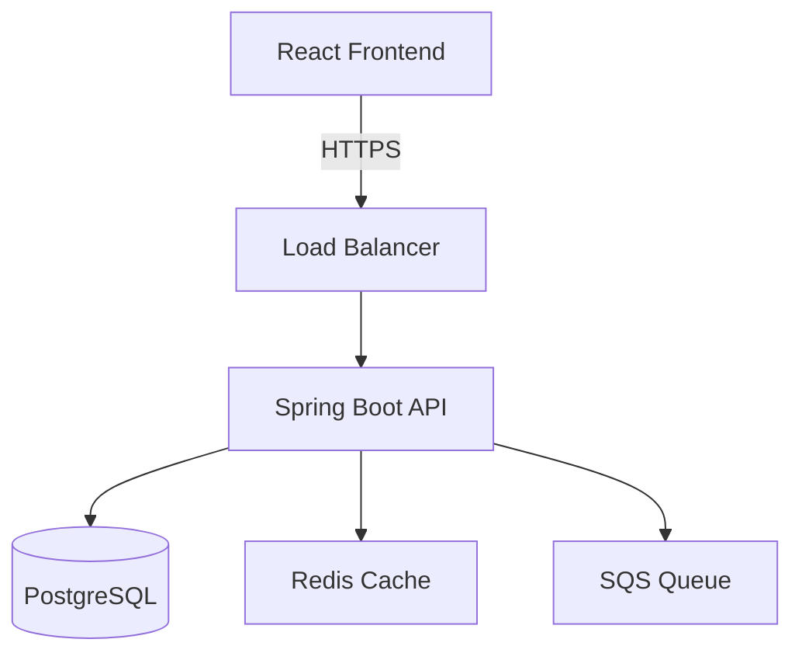

# High-Level Design Workflow

## Step 1 — Inputs Required
Before starting, confirm:
- [ ] Approved user stories / epic exists in `/docs/requirements/`
- [ ] NFRs are defined (performance, availability, security targets)
- [ ] Existing architecture docs read (`/docs/architecture/`)

## Step 2 — Clarify Integration and Auth Assumptions

Before producing the HLD, confirm the following with the user or verify from the requirements. Do not assume defaults — wrong assumptions here cause expensive rework.

### Integration patterns
For each external system identified in the requirements:
1. Who initiates the interaction? (our system, the external system, or the user's browser)
2. What is the integration mechanism? (REST API call, deep link/URL redirect, message queue, file transfer, embedded iframe)
3. Is it synchronous or asynchronous?
4. What data is exchanged, and does any of it contain PII? (PII must never appear in URLs or query parameters)

### Authentication and authorisation
1. How do end users authenticate? (OAuth2 via frontend, SSO redirect, API key, certificate)
2. Which system initiates the auth flow? (frontend redirect to IdP, backend token validation, both)
3. Are there machine-to-machine integrations that need separate auth? (Client Credentials, mTLS, API key)
4. What roles/permissions exist and who manages them? (IdP-managed, application-managed, both)

Do not proceed to Step 3 until these are confirmed.

## Step 3 — Produce the HLD Document
Create `/docs/architecture/hld/HLD-{feature}.md`:

```markdown
# HLD: {Feature Title}
**Date:** YYYY-MM-DD
**Author:** {name}
**Status:** Draft | In Review | Approved
**Stories:** US-{id}, US-{id}

## 1. Overview
Brief description of the feature and its place in the system.

## 2. Goals and Non-Goals
**Goals:**
- ...
**Non-Goals:**
- ...

## 3. High-Level Architecture



## 4. Component Responsibilities
| Component | Responsibility |
|-----------|---------------|
| ...       | ...           |

## 5. Data Flow
Describe the primary data flows for this feature.

## 6. Integration Points
List external systems, APIs, or services this feature interacts with.

## 7. Security Considerations
- Data classification
- Encryption requirements
- Network security

## 8. Authentication and Authorisation Flow
Describe the complete auth flow:
- How end users authenticate (which system initiates, which system validates)
- Token lifecycle (issuance, validation, refresh, expiry)
- How deep links or external launches interact with the auth flow
- Machine-to-machine auth (if any) — or explicitly state "none required"
- Roles and permissions

## 9. API Design
| Method | Path | Description | Auth |
|--------|------|-------------|------|
| ...    | ...  | ...         | ...  |

## 10. Non-Functional Requirements
| NFR | Target | Approach |
|-----|--------|----------|
| Latency | p95 < 200ms | ... |
| Availability | 99.9% | ... |

## 11. Risks and Mitigations
| Risk | Likelihood | Impact | Mitigation |
|------|------------|--------|------------|

## 12. Open Questions
- ...
```

## Step 4 — Raise ADR (if a significant decision is made)
See the `/adr-creation` skill or use the ADR template from the solution-architect agent.

## Step 5 — Update Traceability Matrix
Fill in the `HLD Ref` column in `/docs/requirements/traceability-matrix.md`.
