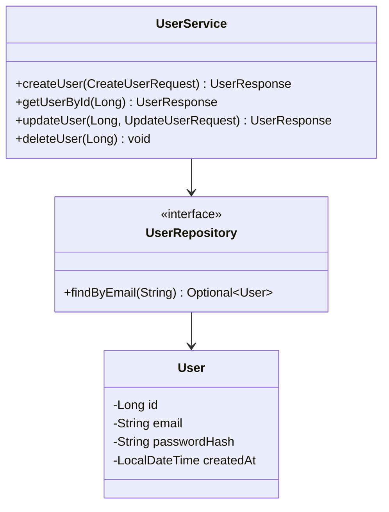
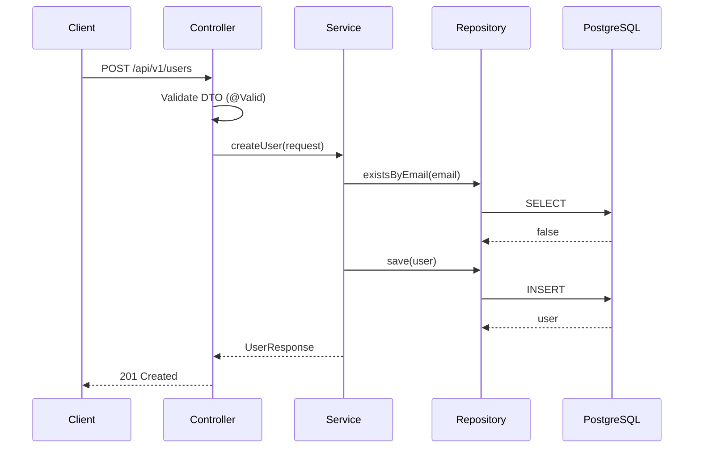

# Low-Level Design Workflow

## Step 1 — Inputs Required
- [ ] Approved HLD exists at `/docs/architecture/hld/HLD-{feature}.md`
- [ ] User stories and acceptance criteria reviewed

## Step 2 — Produce the LLD Document
Create `/docs/design/lld/LLD-{feature}.md`:

```markdown
# LLD: {Feature Title}
**Date:** YYYY-MM-DD
**HLD Reference:** HLD-{feature}
**Status:** Draft | In Review | Approved

## 1. Class Diagram



## 2. Sequence Diagram



## 3. API Contract
Summarise endpoints; full spec in `/docs/design/api/{resource}-api.yaml`.

| Method | Path | Auth | Description |
|--------|------|------|-------------|
| POST | /api/v1/users | None | Register new user |
| GET | /api/v1/users/{id} | Bearer | Get user by ID |

## 4. Database Schema

```sql
-- V2__create_users_table.sql
CREATE TABLE users (
    id           BIGSERIAL PRIMARY KEY,
    email        VARCHAR(255) NOT NULL UNIQUE,
    password_hash VARCHAR(60) NOT NULL,
    first_name   VARCHAR(100),
    last_name    VARCHAR(100),
    created_at   TIMESTAMPTZ NOT NULL DEFAULT now(),
    updated_at   TIMESTAMPTZ NOT NULL DEFAULT now()
);

CREATE INDEX idx_users_email ON users(email);
```

## 5. DTO Definitions

```java
// Request
public record CreateUserRequest(
    @NotBlank @Email String email,
    @NotBlank @Size(min = 8) String password,
    @NotBlank String firstName,
    @NotBlank String lastName
) {}

// Response
public record UserResponse(
    Long id,
    String email,
    String firstName,
    String lastName,
    LocalDateTime createdAt
) {}
```

## 6. Error Scenarios
| Scenario | HTTP Status | Error Code |
|----------|-------------|------------|
| Email already exists | 409 | USER_EMAIL_CONFLICT |
| Validation failure | 400 | VALIDATION_ERROR |
```

## Step 3 — Produce OpenAPI Spec
Create `/docs/design/api/{resource}-api.yaml` using OpenAPI 3.1.

## Step 4 — Update Traceability Matrix
Fill in the `LLD Ref` column in `/docs/requirements/traceability-matrix.md`.
