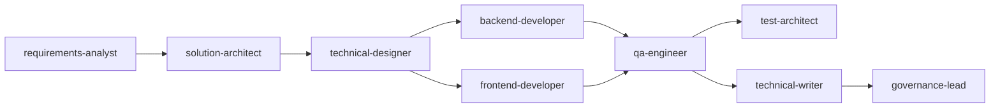

# Using the SDLC Agents

**Purpose:** Reference for what each agent does, how to invoke it, what it needs before it can start, and what it produces.
**Audience:** Anyone using this harness to work on a project — developers, testers, and reviewers.
**Status:** Living document — update it when an agent's behaviour or output changes.

---

## Getting Set Up

If `.claude/` was copied into this project from the shared template (rather than this being the template repo itself), bootstrap it first:

1. Copy the whole `.claude/` folder into the project root (agents, skills, commands, rules, hooks, patterns).
2. Run `/init-sdlc` — it creates the required `docs/` structure, generates `CLAUDE.md`, wires the hooks into `.claude/settings.json`, and sets up `.gitignore`. It's idempotent, so it's safe to re-run any time you pull in a newer copy of `.claude/`.
3. Open just this project as the workspace root in your IDE — not a multi-folder workspace.

---

## How Agents Work

Every agent in `.claude/agents/` follows the same pattern:

1. **Loads its mandatory skill(s) first** — before producing any output, it reads the relevant `SKILL.md` file(s) in full. This is non-negotiable, not a suggestion.
2. **Verifies its upstream input exists** — e.g. `technical-designer` won't start without an approved HLD; `backend-developer` won't start without an approved LLD. If the input is missing, the agent stops and tells you which agent to run first.
3. **Follows the skill's workflow exactly** — agents don't invent their own document structure or implementation order.
4. **For the two dev agents, never declares done without running tests** — `backend-developer` runs `./gradlew build`; `frontend-developer` runs `npm run test` and `npm run build`.
5. **Updates `CLAUDE.md`** per `.claude/rules/claude-md.md` after finishing — stack choices, repository layout, and design decisions get recorded as they're made.

**Invoke an agent** with `@agent-name <what you want>`, e.g. `@backend-developer implement US-42 — read the LLD first`.

**Run the whole pipeline** with `/new-feature US-{id} or description` — it drives all 8 development agents in order below, confirming output at each step before moving to the next.

---

## Typical End-to-End Flow

1. `requirements-analyst` — capture requirements (epics + user stories)
2. `solution-architect` — produce the HLD and any ADRs
3. `technical-designer` — produce the LLD and OpenAPI contract
4. `backend-developer` / `frontend-developer` — implement
5. `qa-engineer` — test plan and missing tests (`test-architect` for the overall strategy)
6. `technical-writer` — update docs
7. `governance-lead` — Definition of Done / release gate check

---

## Agent Reference

### requirements-analyst

**Role:** Captures user stories, acceptance criteria, and requirements traceability. Asks clarifying questions before writing anything and decomposes large features into domain-grouped epics.

**Invoke:** `@requirements-analyst capture requirements for [your feature]`

**Needs before it starts:** Nothing upstream — this is usually the first agent in the pipeline.

**Produces:**
- Epic: `docs/requirements/epics/EP-{id}-{title}.md`
- User stories (one file per story): `docs/requirements/stories/US-{id}-{title}.md`
- Updates: `docs/requirements/traceability-matrix.md`

**What good output looks like:**
- Asked clarifying questions first and waited for your answers before writing anything
- Acceptance criteria are genuinely testable Gherkin, not vague prose
- Saved to the correct file locations
- A developer could build from this without asking you anything else

**Troubleshooting:**

| Problem | Fix |
|---------|-----|
| Skips clarifying questions | Strengthen the CRITICAL BEHAVIOUR section: add "DO NOT produce any output until you have received answers" |
| Wrong file locations | Check output standards say MUST not should |
| Skill not followed | Verify `.claude/skills/requirements-capture/SKILL.md` exists |
| Single combined document | Add: "one file per story — never combine into a single file" |

---

### solution-architect

**Role:** High-level design, ADRs, system architecture, and component diagrams.

**Invoke:** `@solution-architect produce a high level design for [feature]`

**Needs before it starts:** Approved requirements exist in `docs/requirements/`.

**Produces:**
- HLD: `docs/architecture/hld/HLD-{feature}.md`
- ADRs: `docs/architecture/adr/ADR-{id}-{short-title}.md`

**What good output looks like:**
- Read requirements before designing — didn't invent its own scope
- Diagram reflects your actual stack and deployment units
- Flagged security concerns
- Checked the approved catalog before recommending anything
- Scanned `.claude/patterns/markdown/` and referenced a relevant pattern by name (or explicitly noted "no pattern fits" in Open Questions)
- Stopped and asked before defaulting on any approved-catalog "Decisions Requiring Explicit User Confirmation" item (e.g. ECS Fargate vs. EKS) — never silently picked one
- Raised a boundary warning if command and query were conflated

**Troubleshooting:**

| Problem | Fix |
|---------|-----|
| Invents scope | Add "MUST read docs/requirements/ before starting" to STEP 2 |
| Recommends unapproved tech | Check catalog hook in `settings.json` is wired correctly |
| Skips ADR | Make ADR creation mandatory, not optional |
| Doesn't define deployment units | Strengthen STEP 3 in the agent |
| Ignores the patterns directory | Strengthen the "Consult Cloud Application Patterns" step in `hld-architecture` |
| Silently defaults on a catalog decision point | Strengthen the "Confirm Catalog Decision Points" step — it must ask, never assume |

---

### technical-designer

**Role:** Low-level design: class diagrams, sequence diagrams, API contracts, database schema.

**Invoke:** `@technical-designer produce the low level design for [feature]`

**Needs before it starts:** An approved HLD exists at `docs/architecture/hld/`.

**Produces:**
- LLD: `docs/design/lld/LLD-{feature}.md`
- OpenAPI spec: `docs/design/api/{resource}-api.yaml`
- DB schema design: `docs/design/db/schema-{feature}.md`
- Flyway migration: `backend/src/main/resources/db/migration/V{version}__{description}.sql`

**What good output looks like:**
- Checked the HLD exists before starting
- Confirmed which component boundary it's working within
- Class names and package structure are consistent with your codebase
- OpenAPI spec matches your standard response envelope
- Flyway SQL is correct PostgreSQL
- No design decisions are left for the developer to make

**Troubleshooting:**

| Problem | Fix |
|---------|-----|
| Doesn't check HLD exists | Strengthen VERIFY INPUTS step |
| Wrong package structure | Add your actual package layout as an example in the agent |
| DTO not using records | Add an explicit example to the `java.md` rule |
| Crosses component boundaries | Check STEP 3 boundary confirmation is clear |

---

### backend-developer

**Role:** Java 21 / Spring Boot 4.1 implementation: controllers, services, repositories, entities, DTOs, security, Flyway migrations.

**Invoke:** `@backend-developer implement [feature] — read the LLD first`

**Needs before it starts:** An approved LLD exists at `docs/design/lld/`.

**Produces:** Code under `backend/src/main/java/com/example/app/` (`config/`, `controller/`, `service/`, `repository/`, `domain/`, `dto/`, `mapper/`, `exception/`, `security/`), unit tests alongside each class, integration tests, Flyway migrations.

**What good output looks like:**
- Followed the implementation order from the skill (migration → entity → repository → DTOs → mapper → service+unit tests → controller+integration tests)
- Idiomatic Java 21 / Spring Boot 4.1, constructor injection only
- Unit tests written alongside each class, not missing
- `./gradlew build` actually passes
- You'd approve it in a code review

**Troubleshooting:**

| Problem | Fix |
|---------|-----|
| Wrong implementation order | `feature-development` skill not loading — check agent STEP 1 |
| Field injection used | Add to `java.md`: "NEVER do this: `@Autowired private UserRepository repo`" |
| No tests written | Add: "DO NOT move to the next class until the test for the current class passes" |
| Doesn't run `./gradlew build` | Make STEP 4 say "running `./gradlew build` is non-negotiable" |

---

### frontend-developer

**Role:** React / TypeScript implementation: components, pages, hooks, API integration, state management, styling.

**Invoke:** `@frontend-developer implement [feature] — read the OpenAPI spec first`

**Needs before it starts:** The OpenAPI spec exists at `docs/design/api/`.

**Produces:** API service in `frontend/src/services/`, components with co-located `*.test.tsx` files under `frontend/src/components/` and `frontend/src/pages/`.

**What good output looks like:**
- Read the OpenAPI spec — didn't invent its own API shape
- All props typed — no `any` anywhere
- React Query used for data fetching — no raw `useEffect`
- Tests query by role and label, from the user's perspective, not by test ID
- `npm run build` passes

No dedicated troubleshooting table exists for this agent yet — if output isn't right, first check both mandatory skills (`feature-development`, `approved-catalog`) are actually being loaded per STEP 1.

---

### qa-engineer

**Role:** Test planning, test case writing, test execution, defect logging, exploratory testing, and quality reporting. Dispatches to one of five skills (`testing`, `exploratory-testing`, `defect-management`, `test-data-management`, `performance-testing`) depending on the task.

**Invoke:**
- `@qa-engineer write tests for [feature] — check coverage first`
- `@qa-engineer plan an exploratory session for [feature]`
- `@qa-engineer triage the defects in [component]`

**Needs before it starts:** Acceptance criteria exist in `docs/requirements/stories/`; for automated tests, the feature code must exist.

**Produces:**
- Test plans: `docs/testing/test-plans/TP-{feature}.md`
- Test cases: `docs/testing/test-cases/TC-{id}-{feature}.md`
- Defect local reference: `docs/testing/defects/DEF-{jira-id}.md`
- Test summary: `docs/testing/reports/TSR-{version}.md`
- Exploratory sessions: `docs/testing/exploratory/ET-{id}-{feature}.md`

**What good output looks like:**
- Checked existing coverage before writing anything new
- Edge cases are realistic, not just the obvious ones
- Playwright tests query by role and label
- Full suite passes at the coverage target defined in the test strategy
- (Exploratory sessions) found at least one issue the automated tests didn't catch

---

### test-architect

**Role:** Owns the overall test strategy, coverage targets, and test approach per feature/release across the whole test pyramid.

**Invoke:** `@test-architect create a test strategy for [feature]`

**Needs before it starts:** User stories and acceptance criteria exist in `docs/requirements/stories/`; NFRs for the feature are understood.

**Produces:**
- Test strategy: `docs/testing/strategy/TS-{feature-or-release}.md`
- Test architecture: `docs/testing/strategy/test-architecture.md`

**What good output looks like:**
- Risk-classified the feature before setting scope
- The risk level is correct for your feature
- Coverage targets are realistic, not just the risk-table defaults
- Entry and exit criteria are specific enough to actually check

---

### technical-writer

**Role:** Writes and maintains API docs, user guides, runbooks, README, architecture summaries, and the changelog.

**Invoke:** `@technical-writer document [feature] — update API docs, user guide, and CHANGELOG`

**Needs before it starts:** The OpenAPI spec and the user stories exist — it never documents from memory or assumption.

**Produces:**
- README: `README.md`
- API reference: `docs/api/`
- User guides: `docs/guides/{audience}/{topic}.md`
- Runbooks: `docs/runbooks/{operation}.md`
- Changelog: `CHANGELOG.md` (Keep a Changelog format, entries under `[Unreleased]`)
- Architecture summary: `docs/architecture/README.md`

**What good output looks like:**
- Someone unfamiliar with the feature could call the API successfully using only the docs
- Every API doc includes a working `curl` example
- The audience is stated at the top of every document

---

### governance-lead

**Role:** Compliance checks, change management, risk assessment, GDPR/DPIA, and release gate approval. Verifies every DoD item by actually reading the relevant files — never rubber-stamps.

**Invoke:**
- `@governance-lead run a DoD check for [feature]`
- `/release-gate v{version}` (drives this agent through the full release checklist)

**Needs before it starts:** Nothing fixed — it reads whatever the DoD item under review requires (test results, `docs/testing/defects/`, `docs/governance/change-requests/`, `CHANGELOG.md`, the approved catalog).

**Produces:**
- Change requests: `docs/governance/change-requests/CR-{id}-{title}.md`
- Risk register: `docs/governance/risk-register.md`
- DPIAs: `docs/governance/dpia/DPIA-{feature}.md`
- Release approval: `docs/governance/release-approvals/RA-{version}.md`
- Security review: `docs/governance/security-reviews/SR-{feature}.md`

**What good output looks like:**
- Actually reads the files — doesn't assume things are done
- Correctly blocks when something is missing, listing every failing item explicitly
- Correctly approves when everything is in order
